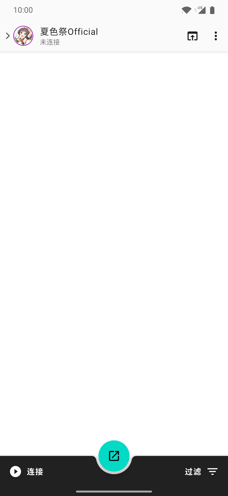
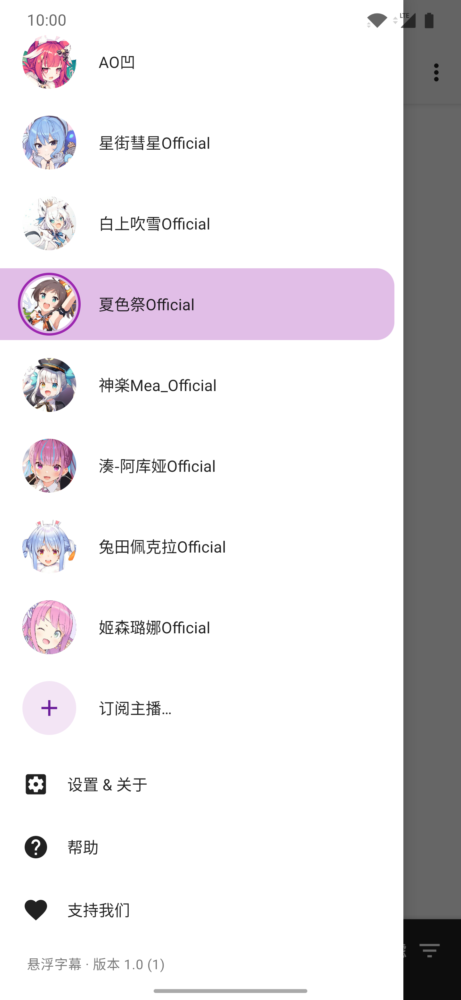
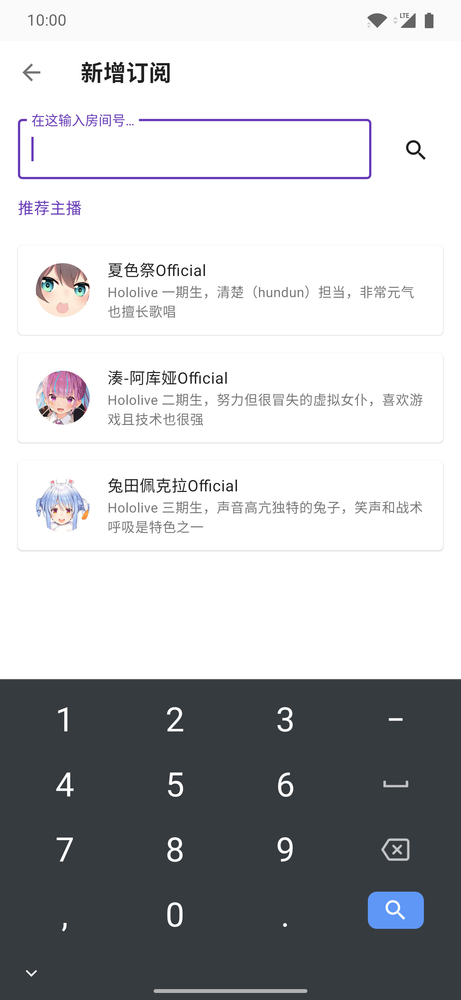
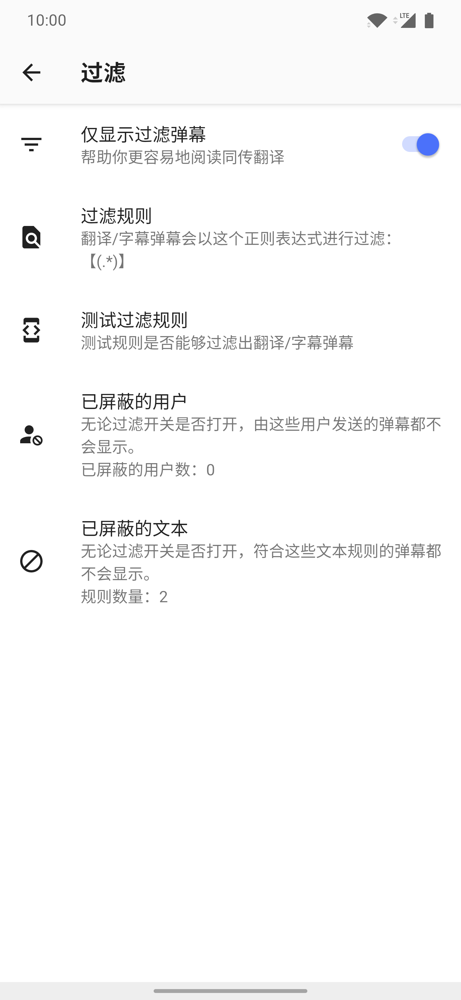
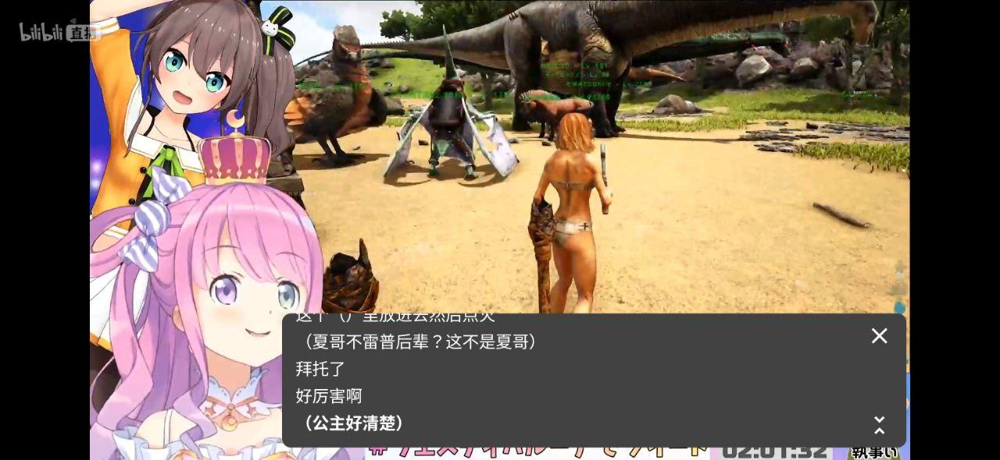

使用帮助
======

## 设计初衷

平时观看的 VTuber 内容以日语为主，自身日语水平非常低，需要阅读大佬在哔哩哔哩直播间中发送的同传翻译弹幕，基本格式为：`【XXXX】`。

想将这些翻译弹幕筛选出来高亮显示为字幕，后来发现网页版直播已经有人做了一个插件将弹幕提取出来（[http://nga.178.com/read.php?tid=17690584](http://nga.178.com/read.php?tid=17690584)），已经使用了一段时间。

开坑之前 Android 上还没有类似的工具，而且移动端（手机、平板电脑）可能比电脑更需要这个软件，因为哔哩哔哩客户端会根据用户设定的最大密度隐藏部分字幕，运气不好的话就可能错过了同传翻译，而且也会有希望关闭自带弹幕的用户需求。

这个坑就因此开挖了。

## 初次使用

从 [GitHub Releases](https://github.com/fython/danmaqua-android/releases) 上获取最新版本的应用并安装后打开，初次引导页会告知你这个应用运行所需要的基本权限。

进入主界面后，页面分为四大部分：顶部状态栏、弹幕列表、底部操作栏和侧边抽屉菜单（通常为左边）。

### 订阅主播

默认是没有订阅任何主播的，你需要点击顶部状态栏的头像按钮或从侧边拉出抽屉菜单：

这个抽屉菜单包含订阅列表、设置、帮助、支持入口。点击“订阅主播…”添加你经常观看的主播：

输入房间号（注意不要输入成用户 ID），点击搜索就可以开始订阅了，订阅之后会回到主界面，从刚刚打开的订阅列表中选择。

选择要观看的直播间，点击连接，应用就会启动服务从哔哩哔哩直播间中获取直播弹幕，你可以在状态栏上看到工作状态。

### 设定过滤

主界面的弹幕列表开始滚动之后，会看到所有人在直播间发送的弹幕。要想只看到同传翻译的弹幕，点击底栏右边的“过滤”按钮打开设置，对过滤开关和规则进行设置：

通常默认的 `【(.*)】` 正则表达式就可以满足大部分直播间中使用中文全角中括号代表同传翻译的习惯，无需更改。除此以外你还可以对不想看到的用户和文本进行屏蔽。

### 启动悬浮窗

设置好过滤规则后返回主界面，可以点击底栏中间的按钮启动悬浮窗，根据你的喜好移动悬浮窗位置、滚动模式，透明度和字体大小可以在设置中选择。

打开哔哩哔哩直播全屏就可以体验到效果了：

